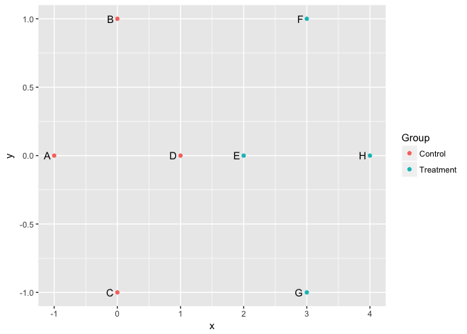

<!-- README.md is generated from README.Rmd. Please edit that file -->
usedist
=======

This package provides useful functions for distance matrix objects in R.

Installation
------------

You can install usedist from github with:

``` r
# install.packages("devtools")
devtools::install_github("usedist/kylebittinger")
```

Utility functions
-----------------

Let's say we have a distance object representing the distances between six rows of data:

``` r
vals <- matrix(rnorm(30), nrow=6)
rownames(vals) <- c("A", "B", "C", "D", "E", "F")
vals
```

    ##         [,1]         [,2]       [,3]       [,4]        [,5]
    ## A  1.2629543 -0.928567035 -1.1476570  0.4356833 -0.05710677
    ## B -0.3262334 -0.294720447 -0.2894616 -1.2375384  0.50360797
    ## C  1.3297993 -0.005767173 -0.2992151 -0.2242679  1.08576936
    ## D  1.2724293  2.404653389 -0.4115108  0.3773956 -0.69095384
    ## E  0.4146414  0.763593461  0.2522234  0.1333364 -1.28459935
    ## F -1.5399500 -0.799009249 -0.8919211  0.8041895  0.04672617

``` r
d <- dist(vals)
d
```

    ##          A        B        C        D        E
    ## B 2.603430                                    
    ## C 1.821423 2.047355                           
    ## D 3.472394 3.727228 3.056922                  
    ## E 2.672239 2.653173 2.734967 2.069155         
    ## F 2.843420 2.543180 3.369470 4.373791 3.129488

The `usedist` package allows us to select the distances for rows B, C, F, and D, *in that order*:

``` r
library(usedist)
```

``` r
dist_subset(d, c("B", "C", "F", "D"))
```

    ##          B        C        F
    ## C 2.047355                  
    ## F 2.543180 3.369470         
    ## D 3.727228 3.056922 4.373791

This is helpful when arranging a distance matrix to match a data frame, for instance with the `adonis` function in `vegan`.

We can extract distances between specified pairs of items, for example distances between rows A-to-C and B-to-E. To do this, we provide two vectors of items: one for the item of origin, and another for the destination.

``` r
origin_row <- c("A", "B")
destination_row <- c("C", "E")
dist_get(d, origin_row, destination_row)
```

    ## [1] 1.821423 2.653173

If items are arranged in groups, we can make a data frame listing the distances between items in group 1 and group 2:

``` r
item_groups <- rep(c("Control", "Treatment"), each=3)
dist_groups(d, item_groups)
```

    ##    Item1 Item2    Group1    Group2                         Label Distance
    ## 1      A     B   Control   Control                Within Control 2.603430
    ## 2      A     C   Control   Control                Within Control 1.821423
    ## 3      A     D   Control Treatment Between Control and Treatment 3.472394
    ## 4      A     E   Control Treatment Between Control and Treatment 2.672239
    ## 5      A     F   Control Treatment Between Control and Treatment 2.843420
    ## 6      B     C   Control   Control                Within Control 2.047355
    ## 7      B     D   Control Treatment Between Control and Treatment 3.727228
    ## 8      B     E   Control Treatment Between Control and Treatment 2.653173
    ## 9      B     F   Control Treatment Between Control and Treatment 2.543180
    ## 10     C     D   Control Treatment Between Control and Treatment 3.056922
    ## 11     C     E   Control Treatment Between Control and Treatment 2.734967
    ## 12     C     F   Control Treatment Between Control and Treatment 3.369470
    ## 13     D     E Treatment Treatment              Within Treatment 2.069155
    ## 14     D     F Treatment Treatment              Within Treatment 4.373791
    ## 15     E     F Treatment Treatment              Within Treatment 3.129488

Also, we provide a function to compute user-defined distances between rows in the data matrix:

``` r
bray_curtis_distance <- function (x1, x2) sum(abs(x1 - x2)) / sum(x1 + x2)
dist_make(vals, bray_curtis_distance)
```

    ##            A          B          C          D          E
    ## B  -2.556549                                            
    ## C   2.508164  14.671790                                 
    ## D   1.895260   5.528607   1.024831                      
    ## E -35.178571  -4.028828   2.292264   1.238016           
    ## F  -1.300526  -1.197491 -12.809167  13.392082  -3.171941

Centroid functions
------------------

The `usedist` package contains functions for computing the distance to group centroid positions. This is accomplished without finding the location of the centroids themselves, though it is assumed that some high-dimensional Euclidean space exists where the centroids can be situated. References for the formulas used can be found in the function documentation.

To illustrate, let's create a set of points in 2-dimensional space. Four points will be centered around the origin, and four around the point (3, 0).

``` r
pts <- data.frame(
  x = c(-1, 0, 0, 1, 2, 3, 3, 4),
  y = c(0, 1, -1, 0, 0, 1, -1, 0),
  Item = LETTERS[1:8],
  Group = rep(c("Control", "Treatment"), each=4))

library(ggplot2)
ggplot(pts, aes(x=x, y=y)) +
  geom_point(aes(color=Group)) +
  geom_text(aes(label=Item), hjust=1.5)
```



Now for the trick: we'll take the distances between points, then figure out the distances to the group centroids using only the point-to-point distances.

``` r
pts_data <- pts[,1:2]
rownames(pts_data) <- pts$Item
pts_distances <- dist(pts_data)
pts_distances
```

    ##          A        B        C        D        E        F        G
    ## B 1.414214                                                      
    ## C 1.414214 2.000000                                             
    ## D 2.000000 1.414214 1.414214                                    
    ## E 3.000000 2.236068 2.236068 1.000000                           
    ## F 4.123106 3.000000 3.605551 2.236068 1.414214                  
    ## G 4.123106 3.605551 3.000000 2.236068 1.414214 2.000000         
    ## H 5.000000 4.123106 4.123106 3.000000 2.000000 1.414214 1.414214

First, we use the function `dist_between_centroids` to calculate the distance between the centroids of the two groups. In our example, we expect to get a distance of 3.

``` r
dist_between_centroids(
  pts_distances, c("A", "B", "C", "D"), c("E", "F", "G", "H"))
```

    ## [1] 3

Now, we use the function `dist_to_centroids` to calculate the distance from each individual point to the group centroids. The within-group distances should all be equal to 1.

``` r
dist_to_centroids(pts_distances, pts$Group)
```

    ##    Item CentroidGroup CentroidDistance
    ## 1     A       Control         1.000000
    ## 2     B       Control         1.000000
    ## 3     C       Control         1.000000
    ## 4     D       Control         1.000000
    ## 5     E       Control         2.000000
    ## 6     F       Control         3.162278
    ## 7     G       Control         3.162278
    ## 8     H       Control         4.000000
    ## 9     A     Treatment         4.000000
    ## 10    B     Treatment         3.162278
    ## 11    C     Treatment         3.162278
    ## 12    D     Treatment         2.000000
    ## 13    E     Treatment         1.000000
    ## 14    F     Treatment         1.000000
    ## 15    G     Treatment         1.000000
    ## 16    H     Treatment         1.000000

Double-checking the between-group distances is left as an exercise for the reader.
