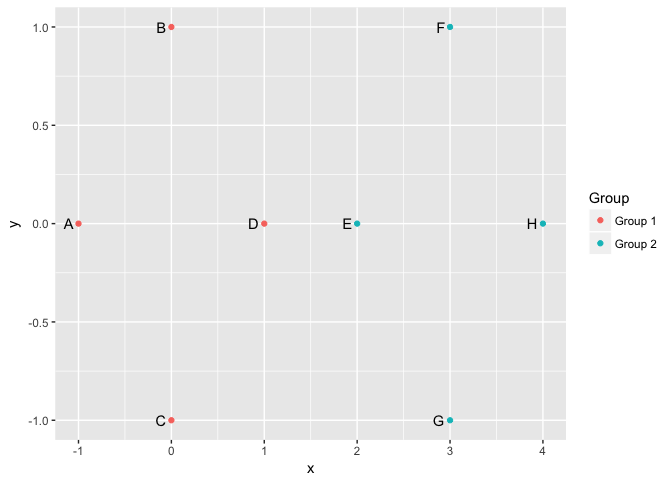

<!-- README.md is generated from README.Rmd. Please edit that file -->
usedist
=======

This package provides useful functions for distance matrix objects in R.

Installation
------------

You can install usedist from github with:

``` r
# install.packages("devtools")
devtools::install_github("usedist/kylebittinger")
```

Utility functions
-----------------

Let's say we have a distance object representing the distances between six rows of data:

``` r
vals <- matrix(rnorm(30), nrow=6)
rownames(vals) <- c("A", "B", "C", "D", "E", "F")
vals
```

    ##         [,1]       [,2]       [,3]       [,4]       [,5]
    ## A  0.3080099  1.5025660  1.0154321 -0.7458623  0.7468710
    ## B -0.2175394  1.0936489  1.7313129  0.5617285  1.4529194
    ## C -1.1566379  1.3458912 -1.1020943 -0.4318047  0.7380702
    ## D -0.4622910 -0.3795433  0.4277032  1.6623954  0.4382995
    ## E -0.4854876  1.3553608  2.7835967 -0.7274690 -0.7632052
    ## F  0.3733852  0.3690530  0.4167975  1.2146403  0.2828254

``` r
d <- dist(vals)
d
```

    ##          A        B        C        D        E
    ## B 1.778819                                    
    ## C 2.598532 3.236023                           
    ## D 3.221187 2.484053 3.205473                  
    ## E 2.461378 2.796574 4.229701 3.964307         
    ## F 2.388807 2.097045 2.918946 1.218001 3.489724

The `usedist` package allows us to select the distances only for rows B, A, F, and D, *in that order*:

``` r
library(usedist)
dist_subset(d, c("B", "A", "F", "D"))
```

    ##          B        A        F
    ## A 1.778819                  
    ## F 2.097045 2.388807         
    ## D 2.484053 3.221187 1.218001

This is helpful when arranging a distance matrix to match a data frame, for instance with the `adonis` function in `vegan`.

We can extract distances between specified pairs of items, for example distances between rows A-to-C and B-to-E:

``` r
origin_row <- c("A", "B")
destination_row <- c("C", "E")
dist_get(d, origin_row, destination_row)
```

    ## [1] 2.598532 2.796574

If items are arranged in groups, we can make a data frame listing the distances between items in group 1 and group 2:

``` r
item_groups <- rep(c("Control", "Treatment"), each=3)
dist_groups(d, item_groups)
```

    ##    Item1 Item2    Group1    Group2                         Label Distance
    ## 1      A     B   Control   Control                Within Control 1.778819
    ## 2      A     C   Control   Control                Within Control 2.598532
    ## 3      A     D   Control Treatment Between Control and Treatment 3.221187
    ## 4      A     E   Control Treatment Between Control and Treatment 2.461378
    ## 5      A     F   Control Treatment Between Control and Treatment 2.388807
    ## 6      B     C   Control   Control                Within Control 3.236023
    ## 7      B     D   Control Treatment Between Control and Treatment 2.484053
    ## 8      B     E   Control Treatment Between Control and Treatment 2.796574
    ## 9      B     F   Control Treatment Between Control and Treatment 2.097045
    ## 10     C     D   Control Treatment Between Control and Treatment 3.205473
    ## 11     C     E   Control Treatment Between Control and Treatment 4.229701
    ## 12     C     F   Control Treatment Between Control and Treatment 2.918946
    ## 13     D     E Treatment Treatment              Within Treatment 3.964307
    ## 14     D     F Treatment Treatment              Within Treatment 1.218001
    ## 15     E     F Treatment Treatment              Within Treatment 3.489724

Also, we provide a function to compute user-defined distances between rows in the data matrix:

``` r
bray_curtis_distance <- function (x1, x2) sum(abs(x1 - x2)) / sum(x1 + x2)
dist_make(vals, bray_curtis_distance)
```

    ##           A         B         C         D         E
    ## B 0.4918705                                        
    ## C 1.8292345 1.4277519                              
    ## D 1.3197878 0.8142556 5.8737209                    
    ## E 0.8491976 0.7497961 4.0889141 2.0017260          
    ## F 0.7699286 0.6117848 2.9888132 0.5061647 1.4939567

Centroid functions
------------------

The `usedist` package contains functions for computing the distance to group centroid positions. This is accomplished without finding the location of the centroids themselves, though it is assumed that some high-dimensional Euclidean space exists where the centroids can be situated. References for the formulas used can be found in the function documentation.

To illustrate, let's create a set of points in 2-dimensional space. Four points will be centered around the origin, and four around the point (3, 0).

``` r
pts <- data.frame(
  x = c(-1, 0, 0, 1, 2, 3, 3, 4),
  y = c(0, 1, -1, 0, 0, 1, -1, 0),
  Item = LETTERS[1:8],
  Group = paste("Group", rep(1:2, each=4)))

library(ggplot2)
ggplot(pts, aes(x=x, y=y)) +
  geom_point(aes(color=Group)) +
  geom_text(aes(label=Item), hjust=1.5)
```



Now for the trick: we'll take the distances between points, then figure out the distances to the group centroids using only the point-to-point distances.

``` r
pts_distances <- dist(pts[,1:2])
pts_distances
```

    ##          1        2        3        4        5        6        7
    ## 2 1.414214                                                      
    ## 3 1.414214 2.000000                                             
    ## 4 2.000000 1.414214 1.414214                                    
    ## 5 3.000000 2.236068 2.236068 1.000000                           
    ## 6 4.123106 3.000000 3.605551 2.236068 1.414214                  
    ## 7 4.123106 3.605551 3.000000 2.236068 1.414214 2.000000         
    ## 8 5.000000 4.123106 4.123106 3.000000 2.000000 1.414214 1.414214

First, we use the function `dist_between_centroids` to calculate the distance between the centroids of the two groups. In our example, we expect to get a distance of 3.

``` r
dist_between_centroids(pts_distances, 1:4, 5:8)
```

    ## [1] 3

Now, we use the function `dist_to_centroids` to calculate the distance from each individual point to the group centroids. The within-group distances should all be equal to 1. Checking the between-group distances is left as an exercise for the reader.

``` r
dist_to_centroids(pts_distances, pts$Group)
```

    ##    Item   Group CentroidDistance
    ## 1     1 Group 1         1.000000
    ## 2     2 Group 1         1.000000
    ## 3     3 Group 1         1.000000
    ## 4     4 Group 1         1.000000
    ## 5     5 Group 1         2.000000
    ## 6     6 Group 1         3.162278
    ## 7     7 Group 1         3.162278
    ## 8     8 Group 1         4.000000
    ## 9     1 Group 2         4.000000
    ## 10    2 Group 2         3.162278
    ## 11    3 Group 2         3.162278
    ## 12    4 Group 2         2.000000
    ## 13    5 Group 2         1.000000
    ## 14    6 Group 2         1.000000
    ## 15    7 Group 2         1.000000
    ## 16    8 Group 2         1.000000
