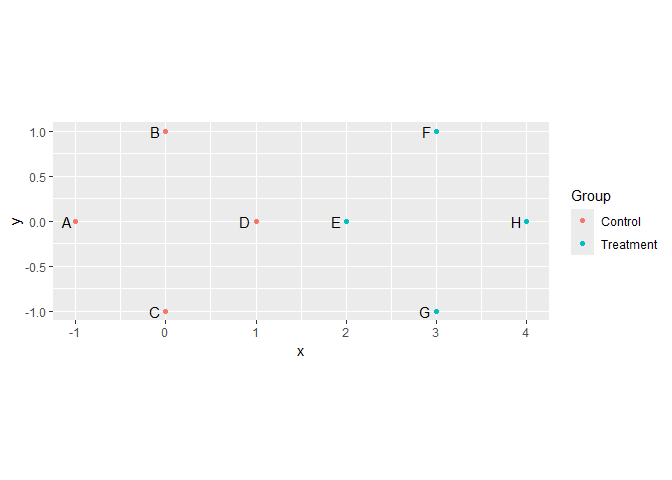

<!-- README.md is generated from README.Rmd. Please edit that file -->

# usedist

This package provides useful functions for distance matrix objects in R.

[](https://travis-ci.org/kylebittinger/usedist)

## Installation

You can install usedist from github with:

``` r
# install.packages("devtools")
devtools::install_github("kylebittinger/usedist")
```

## Introduction to distance matrices in R

In R, the `dist()` function is used to compute a distance matrix. But
the result you get back isn’t really a matrix, it’s a `"dist"` object.
Under the hood, the `"dist"` object is stored as a simple vector. When
it’s printed out, R knows how to make it look like a matrix. Let’s make
a distance object representing the distances between six rows of data.

Here is our data matrix, `X`:

``` r
X <- matrix(rnorm(30), nrow=6)
rownames(X) <- c("A", "B", "C", "D", "E", "F")
X
```

    ##         [,1]         [,2]       [,3]       [,4]        [,5]
    ## A  1.2629543 -0.928567035 -1.1476570  0.4356833 -0.05710677
    ## B -0.3262334 -0.294720447 -0.2894616 -1.2375384  0.50360797
    ## C  1.3297993 -0.005767173 -0.2992151 -0.2242679  1.08576936
    ## D  1.2724293  2.404653389 -0.4115108  0.3773956 -0.69095384
    ## E  0.4146414  0.763593461  0.2522234  0.1333364 -1.28459935
    ## F -1.5399500 -0.799009249 -0.8919211  0.8041895  0.04672617

And here is our `"dist"` object, `d`, representing the distance between
rows of `X`:

``` r
d <- dist(X)
d
```

    ##          A        B        C        D        E
    ## B 2.603430                                    
    ## C 1.821423 2.047355                           
    ## D 3.472394 3.727228 3.056922                  
    ## E 2.672239 2.653173 2.734967 2.069155         
    ## F 2.843420 2.543180 3.369470 4.373791 3.129488

These `"dist"` objects are great, but R does not provide a set of
functions to work with them conveniently. That’s where the `usedist`
package comes in.

## Working with “dist” objects

The `usedist` package provides some basic functions for altering or
selecting distances from a `"dist"` object.

``` r
library(usedist)
```

To start, we can make a new `"dist"` object, containing the distances
between rows B, C, F, and D. Our new object contains the rows *in the
order we specified*:

``` r
dist_subset(d, c("B", "C", "F", "D"))
```

    ##          B        C        F
    ## C 2.047355                  
    ## F 2.543180 3.369470         
    ## D 3.727228 3.056922 4.373791

This is especially helpful when arranging a distance matrix to match a
data frame, for instance with the `adonis()` function in `vegan`.

We can extract distances between specified pairs of rows. For example,
we’ll pull out the distances for rows A-to-D, B-to-E, and C-to-F. To
extract specific distance values, we use `dist_get()`. This function
takes two vectors of row labels: one vector for the rows of origin, and
another for the rows of destination.

``` r
origin_row <- c("A", "B", "C")
destination_row <- c("D", "E", "F")
dist_get(d, origin_row, destination_row)
```

    ## [1] 3.472394 2.653173 3.369470

If rows are arranged in groups, we might like to have a data frame
listing the distances alongside the groups for each pair of rows. The
`dist_groups()` function makes a data frame from the groups, and also
adds in a nice label that you might use for plots.

``` r
item_groups <- rep(c("Control", "Treatment"), each=3)
dist_groups(d, item_groups)
```

    ##    Item1 Item2    Group1    Group2                         Label Distance
    ## 1      A     B   Control   Control                Within Control 2.603430
    ## 2      A     C   Control   Control                Within Control 1.821423
    ## 3      A     D   Control Treatment Between Control and Treatment 3.472394
    ## 4      A     E   Control Treatment Between Control and Treatment 2.672239
    ## 5      A     F   Control Treatment Between Control and Treatment 2.843420
    ## 6      B     C   Control   Control                Within Control 2.047355
    ## 7      B     D   Control Treatment Between Control and Treatment 3.727228
    ## 8      B     E   Control Treatment Between Control and Treatment 2.653173
    ## 9      B     F   Control Treatment Between Control and Treatment 2.543180
    ## 10     C     D   Control Treatment Between Control and Treatment 3.056922
    ## 11     C     E   Control Treatment Between Control and Treatment 2.734967
    ## 12     C     F   Control Treatment Between Control and Treatment 3.369470
    ## 13     D     E Treatment Treatment              Within Treatment 2.069155
    ## 14     D     F Treatment Treatment              Within Treatment 4.373791
    ## 15     E     F Treatment Treatment              Within Treatment 3.129488

You might have your own distance function that you’d like to use, beyond
the options available in `dist()` or `vegan::vegdist()`. For example,
the RMS distance is kind of like the Euclidean distance, but you take
the mean of the squared differences instead of the sum inside the square
root. Let’s define the distance function:

``` r
rms_distance <- function (r1, r2) {
  sqrt(mean((r2- r1) ^ 2))
}
```

Then, we can pass it to `dist_make()` to create a new distance matrix of
RMS distances.

``` r
dist_make(X, rms_distance)
```

    ##           A         B         C         D         E
    ## B 1.1642895                                        
    ## C 0.8145653 0.9156050                              
    ## D 1.5529017 1.6668670 1.3670972                    
    ## E 1.1950614 1.1865353 1.2231143 0.9253541          
    ## F 1.2716160 1.1373449 1.5068729 1.9560190 1.3995495

## Centroid functions

The `usedist` package contains functions for computing the distance to
group centroid positions. This is accomplished without finding the
location of the centroids themselves, though it is assumed that some
high-dimensional Euclidean space exists where the centroids can be
situated. References for the formulas used can be found in the function
documentation.

To illustrate, let’s create a set of points in 2-dimensional space. Four
points will be centered around the origin, and four around the point (3,
0).

``` r
pts <- data.frame(
  x = c(-1, 0, 0, 1, 2, 3, 3, 4),
  y = c(0, 1, -1, 0, 0, 1, -1, 0),
  Item = LETTERS[1:8],
  Group = rep(c("Control", "Treatment"), each=4))

library(ggplot2)
ggplot(pts, aes(x=x, y=y)) +
  geom_point(aes(color=Group)) +
  geom_text(aes(label=Item), hjust=1.5) +
  coord_equal()
```

<!-- -->

Our goal is to figure out distances for the group centroids using only
the distances between points. First, we need to put the data in matrix
format.

``` r
pts_matrix <- as.matrix(pts[,c("x", "y")])
rownames(pts_matrix) <- pts$Item
```

Now, we’ll compute the point-to-point distances with `dist()`.

``` r
pts_distances <- dist(pts_matrix)
pts_distances
```

    ##          A        B        C        D        E        F        G
    ## B 1.414214                                                      
    ## C 1.414214 2.000000                                             
    ## D 2.000000 1.414214 1.414214                                    
    ## E 3.000000 2.236068 2.236068 1.000000                           
    ## F 4.123106 3.000000 3.605551 2.236068 1.414214                  
    ## G 4.123106 3.605551 3.000000 2.236068 1.414214 2.000000         
    ## H 5.000000 4.123106 4.123106 3.000000 2.000000 1.414214 1.414214

The function `dist_between_centroids()` will calculate the distance
between the centroids of the two groups. Here, we expect to get a
distance of 3.

``` r
dist_between_centroids(
  pts_distances, c("A", "B", "C", "D"), c("E", "F", "G", "H"))
```

    ## [1] 3

The function is only using the distance matrix; it doesn’t know where
the individual points are in space.

We can use another function, `dist_to_centroids()`, to calculate the
distance from each individual point to the group centroids. Again, this
works without knowing the point locations, only the distances between
points. In our example, the distances within the Control group and
within the Treatment group should all be equal to 1.

``` r
dist_to_centroids(pts_distances, pts$Group)
```

    ##    Item CentroidGroup CentroidDistance
    ## 1     A       Control         1.000000
    ## 2     B       Control         1.000000
    ## 3     C       Control         1.000000
    ## 4     D       Control         1.000000
    ## 5     E       Control         2.000000
    ## 6     F       Control         3.162278
    ## 7     G       Control         3.162278
    ## 8     H       Control         4.000000
    ## 9     A     Treatment         4.000000
    ## 10    B     Treatment         3.162278
    ## 11    C     Treatment         3.162278
    ## 12    D     Treatment         2.000000
    ## 13    E     Treatment         1.000000
    ## 14    F     Treatment         1.000000
    ## 15    G     Treatment         1.000000
    ## 16    H     Treatment         1.000000

You can use the Pythagorean theorem to check that the other distances
are correct. The distance between point “G” and the centroid for the
*Control* group should be sqrt(3<sup>2</sup> + 1<sup>2</sup>) = sqrt(10)
= 3.162278.

## Long format data

Many times, the data is not stored as a matrix, but is represented in
“long” format as a data frame. In this case, one column of the data
frame gives the row label for the matrix, another indicates the column
label, and a third provides the value. To get a real data matrix, we
have to “pivot” the data frame and convert to matrix form. Because this
is such a common operation, `usedist` includes a convenience function,
`pivot_to_numeric_matrix`.

Here is an example of data in long format:

``` r
data_long <- data.frame(
  row_label = c("A", "A", "A", "B", "B", "C", "C"),
  column_label = c("x", "y", "z", "x", "y", "y", "z"),
  matrix_value = rpois(7, 12))
data_long
```

    ##   row_label column_label matrix_value
    ## 1         A            x           11
    ## 2         A            y           10
    ## 3         A            z           10
    ## 4         B            x            9
    ## 5         B            y            7
    ## 6         C            y           15
    ## 7         C            z           10

The data table has no value for row “B” and column “z”. By convention, a
value of 0 is filled in for missing combinations when we convert to
matrix format. Here is how we convert:

``` r
data_matrix <- pivot_to_numeric_matrix(
  data_long, row_label, column_label, matrix_value)
data_matrix
```

    ##    x  y  z
    ## A 11 10 10
    ## B  9  7  0
    ## C  0 15 10

Note that we provide bare column names in the call to
`pivot_to_numeric_matrix()`. This function requires some extra packages
to be installed. They are listed as suggestions for `usedist`. If the
additional packages are not installed on your system, you’ll get an
error message with the missing packages listed.

The matrix format is what we need for distance calculations. If you want
to convert from long format and use a custom distance function, you can
combine `pivot_to_numeric_matrix()` with `dist_make()`:

``` r
dist_make(data_matrix, rms_distance)
```

    ##          A        B
    ## B 6.137318         
    ## C 6.976150 9.036961
